# Stakeholder API Sets

> **Generated** by `docs/tools/build_stakeholder_views.py` from `docs/stakeholder-activities.yaml`, `docs/stakeholders.md` and `docs/endpoint-catalogue.md`. Do not edit by hand; edit the sources and re-run.

Status of each endpoint: **W** working POC · **M** mock integration · **P** planned contract · **?** definition pending · **NEW** needed by an activity but missing from the catalogue.

## Summary

| Measure | Count |
|---|---|
| Stakeholders | 114 |
| Activities | 231 |
| Stakeholders with at least one API | 97 |
| Stakeholders with activities but no API (external systems via adapters, or oversight bodies) | 17 |
| Stakeholders with no activity yet | 0 |
| **NEW endpoints to add to the catalogue** | **0** |
| Catalogue endpoints no stakeholder calls | 0 |

## API set per stakeholder

### A. Members, beneficiaries and the public

#### `public` — Public visitor (establishment search, calculators, circulars)

Activities: **F13.public** Browse schemes, offices, statistics, circulars; search establishments; calculators; TRRN status

| Endpoint | Status |
|---|---|
| `GET /public/establishments` | W |
| `GET /public/establishments/{estId}` | W |
| `GET /public/offices` | W |
| `GET /public/schemes` | W |
| `GET /public/statistics` | W |
| `POST /ai/knowledge/search` | W |
| `POST /public/demo-calculations/epf` | W |
| `GET /public/demo-challenges` | M |
| `POST /public/trrn-status-lookups` | M |
| `GET /public/circulars` | P |
| `GET /public/defaulting-establishments` | P |
| `GET /public/establishments/{estId}/e-report-card` | P |
| `POST /public/demo-calculations/pension` | P |

#### `member` — Member — active contributor (UAN holder)

Activities: **F02.uan_self** Self-generate / activate UAN with Aadhaar face authentication (UMANG) or OTP; **F02.kyc_seed** Seed KYC (Aadhaar, bank, PAN); **F02.self_service** View profile, service history, UAN card; change contact details; e-nomination; self-marked exit; **F02.jd_submit** Submit Joint Declaration to correct one of 12 profile parameters; **F03.passbook** View passbook, annual statement and taxable-interest split; **F04.preflight** Pre-flight before filing: check account readiness (blockers), service history and eligibility for the chosen form; **F04.claim_file** Check eligibility and file a claim (Form 31 / 19 / 10C); confirm intent; upload documents; **F04.post_submission** After filing: follow the claim's audit trail, cancel it before a decision, or switch to another KYC-verified bank account before payment; **F04.redisburse_request** Submit corrected bank details after a payment return; **F04.track** Track claims and notifications; download Form 16A; **F04.transfer** Request Form 13 transfer; confirm auto-transfer; view Annexure K; **F05.apply** Apply for monthly pension (Form 10D) or scheme certificate; **F05.preview** Pre-check pension eligibility across all member IDs; see untransferred service to fix first (Form 13); **F05.sc_surrender** Surrender a Scheme Certificate for monthly pension or withdrawal benefit; **F05.higher_member** Apply for pension on higher wages (joint option); track status; **F07.member_report** Report suspicious activity; account recovery; view sessions; **F08.member_file** Register, track, reopen, remind and give feedback on grievances; **F14.step_up** Complete step-up confirmation for sensitive actions

| Endpoint | Status |
|---|---|
| `GET /grievances/{grievanceId}` | W |
| `GET /members/me` | W |
| `GET /members/me/accounts/{accountLinkId}/passbook` | W |
| `GET /members/me/claims` | W |
| `GET /members/me/claims/eligible-types` | W |
| `GET /members/me/claims/{claimId}` | W |
| `GET /members/me/employment-history` | W |
| `GET /members/me/grievances` | W |
| `GET /members/me/identity-assurance` | W |
| `GET /members/me/notifications` | W |
| `GET /members/me/passbook` | W |
| `GET /members/me/sessions` | W |
| `PATCH /members/me/contact-details` | W |
| `POST /grievances/{grievanceId}/documents` | W |
| `POST /grievances/{grievanceId}/escalations` | W |
| `POST /grievances/{grievanceId}/messages` | W |
| `POST /grievances/{grievanceId}/reopen-requests` | W |
| `POST /members/me/account-recovery-requests` | W |
| `POST /members/me/claims` | W |
| `POST /members/me/claims/{claimId}/confirmations` | W |
| `POST /members/me/grievances` | W |
| `POST /members/me/security-reports` | W |
| `POST /security/step-up-challenges` | W |
| `POST /security/step-up-challenges/{challengeId}/verifications` | W |
| `POST /members/me/kyc/bank-accounts` | M |
| `POST /members/me/kyc/{kycType}` | M |
| `POST /members/uan-activations` | M |
| `POST /members/uan-allotments` | M |
| `GET /members/me/account-status` | P |
| `GET /members/me/annual-statements/{financialYear}` | P |
| `GET /members/me/claims/eligibility-preview` | P |
| `GET /members/me/claims/{claimId}/audit-trail` | P |
| `GET /members/me/higher-pension-options/{optionId}` | P |
| `GET /members/me/kyc` | P |
| `GET /members/me/nominations` | P |
| `GET /members/me/pension-eligibility-preview` | P |
| `GET /members/me/pension-scheme-certificate` | P |
| `GET /members/me/service-history` | P |
| `GET /members/me/tax/form-16a` | P |
| `GET /members/me/tax/taxable-interest` | P |
| `GET /members/me/transfers/auto` | P |
| `GET /members/me/transfers/{transferId}` | P |
| `GET /members/me/transfers/{transferId}/annexure-k` | P |
| `GET /members/me/uan-card` | P |
| `POST /grievances/{grievanceId}/feedback` | P |
| `POST /grievances/{grievanceId}/reminders` | P |
| `POST /members/me/claims/{claimId}/cancellations` | P |
| `POST /members/me/claims/{claimId}/documents` | P |
| `POST /members/me/claims/{claimId}/re-disbursement-requests` | P |
| `POST /members/me/exits` | P |
| `POST /members/me/higher-pension-options` | P |
| `POST /members/me/joint-declarations` | P |
| `POST /members/me/nominations` | P |
| `POST /members/me/pension-applications` | P |
| `POST /members/me/pension-scheme-certificates` | P |
| `POST /members/me/pension-scheme-certificates/{certId}/surrenders` | P |
| `POST /members/me/tax/form-15g-15h` | P |
| `POST /members/me/transfers` | P |
| `POST /members/me/transfers/auto/{transferId}/confirmations` | P |
| `POST /members/uan-lookups` | P |
| `POST /public/claims/status-lookups` | P |
| `PUT /members/me/claims/{claimId}/bank-details` | P |

Integration adapters: `uidai`

#### `member.exited` — Member — exited / inoperative account holder

Activities: **F11.search** Search inoperative accounts; request reactivation / settlement (online, at FO or NAN camp)

| Endpoint | Status |
|---|---|
| `POST /members/me/claims` | W |
| `POST /public/inoperative-accounts/searches` | P |

#### `member.disabled` — Member with disability (disablement pension)

Activities: **F05.disabled_apply** Apply for disablement pension

| Endpoint | Status |
|---|---|
| `POST /members/me/pension-applications` | P |

#### `pensioner` — Pensioner (member / early / disablement pension)

Activities: **F05.pensioner_view** View PPO, pension slips, payments; change bank; declarations; public pension enquiries; **F05.dlc** Submit Digital Life Certificate; check status; **F08.pensioner_file** Register pension grievance

| Endpoint | Status |
|---|---|
| `GET /pensioners/me/life-certificate` | M |
| `POST /pensioners/me/life-certificate/submissions` | M |
| `POST /public/pension/life-certificate-lookups` | M |
| `GET /pensioners/me` | P |
| `GET /pensioners/me/payments` | P |
| `GET /pensioners/me/pension-slips` | P |
| `GET /pensioners/me/ppo` | P |
| `POST /pensioners/me/bank-change-requests` | P |
| `POST /public/grievances` | P |
| `POST /public/pension/payment-enquiries` | P |
| `POST /public/pension/ppo-lookups` | P |
| `POST /public/pension/status-enquiries` | P |

Integration adapters: `jeevan_pramaan`

#### `family_pensioner` — Widow(er), child, orphan, dependent-parent pensioner

Activities: **F05.family_apply** Apply for widow / child / orphan / dependent-parent pension; **F05.family_view** View pension; submit non-remarriage / non-employment declarations

| Endpoint | Status |
|---|---|
| `GET /pensioners/me` | P |
| `POST /claimants/family-pension-applications` | P |
| `POST /pensioners/me/declarations` | P |

#### `claimant` — Nominee / legal heir / guardian claiming PF, EDLI or pension on death

Activities: **F04.death_claim** File PF (Form 20), EDLI (Form 5IF) or composite death claim

| Endpoint | Status |
|---|---|
| `GET /claimants/death-claims/{claimId}` | P |
| `POST /claimants/death-claims` | P |

#### `claimant.nominee` — Co-beneficiary on a multi-beneficiary death claim (PF / EDLI / pension) holding an allocated percentage share, including shares already settled in the legacy system

Activities: **F04.co_beneficiary** Inward as an additional beneficiary on an open death claim and track own share

| Endpoint | Status |
|---|---|
| `GET /claimants/death-claims/{claimId}` | P |
| `POST /claimants/death-claims/{claimId}/beneficiaries` | P |

#### `intl_worker` — International worker (inbound or outbound, CoC holder)

Activities: **F10.worker** View own international-worker status and CoC (no direct IWU login found; member-portal view is a future option)

| Endpoint | Status |
|---|---|
| `GET /members/me/international` | P |

#### `complainant` — Grievance complainant who is not logged in (member, pensioner, employer, other)

Activities: **F08.public_file** Register grievance without login (pensioner, employer, others); check status

| Endpoint | Status |
|---|---|
| `POST /public/grievances` | P |
| `POST /public/grievances/status-lookups` | P |

#### `rti_applicant` — RTI applicant

Activities: **F08.rti** File RTI request (handled through the RTI portal; answered by the office)

Integration adapters: `rti_portal`

### B. Employers and intermediaries

#### `employer.owner` — Establishment owner / employer (legal entity)

Activities: **F01.register** Register establishment online and submit verification evidence; **F01.dsc_register** Register DSC or e-sign of an authorised signatory and submit the request letter; **F01.signatories** View the establishment; authorise or revoke signatories; **F01.operators** Invite, scope and revoke employer sub-users (User / Admin menus)

| Endpoint | Status |
|---|---|
| `GET /employers/me` | W |
| `GET /employers/me/operators` | W |
| `GET /employers/me/signatories` | W |
| `GET /employers/registration-requests/{reqId}` | W |
| `POST /employers/me/operators/invitations` | W |
| `POST /employers/me/operators/{operatorId}/revocations` | W |
| `POST /employers/me/signatories/authorisations` | W |
| `POST /employers/me/signatories/{signatoryId}/revocations` | W |
| `POST /employers/registration-requests` | W |
| `POST /employers/me/signatories/{signatoryId}/dsc-registrations` | M |
| `POST /employers/me/signatories/{signatoryId}/esign-registrations` | M |
| `POST /employers/registration-requests/{reqId}/verification-evidence` | M |

#### `employer.signatory` — Authorised signatory (registered DSC / e-sign)

Activities: **F01.form5a** File / update Form 5A ownership return and branches (Form 2A), signed with DSC / e-sign; **F01.signatory_profile** View the establishment before approving returns and payments; **F01.change_request** Request configuration change, closure / deregistration or office transfer; **F02.kyc_approve** Approve KYC seeded by member / pending for digital signature, with DSC or e-sign; **F02.employer_approvals** Approve queued member changes (Member > Approvals); **F02.jd_attest** Attest, return or reject the Joint Declaration; employer-initiated JD; **F03.ecr_approve** Review, approve and submit ECR (generates TRRN); cancel an unpaid TRRN; **F03.pay** Pay challan online (or via bank counter where allowed) and download the payment receipt; **F03.direct_challan** Create a Direct Challan: administrative / inspection charges, or miscellaneous challan for 14B damages and 7Q interest; pay demands; **F04.attest** Attest claims that need employer attestation; **F04.transfer_attest** Attest pending transfer claims (Online Services > Transfer Claims); **F05.higher_employer** Validate joint options and upload wage details; **F06.employer_reply** Reply and submit evidence in proceedings; **F06.vishwas_apply** Apply under VISHWAS to settle a 14B damages / penalty dispute at reduced rates; **F10.apply** Apply for / extend CoC for a posted worker (IWU portal EMPLOYER login); upload signed application; download CoC

| Endpoint | Status |
|---|---|
| `GET /employers/me` | W |
| `GET /employers/me/challans` | W |
| `GET /employers/me/challans/{trrn}` | W |
| `GET /employers/me/challans/{trrn}/receipt` | W |
| `GET /employers/me/ecr-filings` | W |
| `GET /employers/me/ecr-filings/{filingId}` | W |
| `POST /employers/me/ecr-filings/{filingId}/approvals` | W |
| `POST /employers/me/ecr-filings/{filingId}/submissions` | W |
| `GET /international/coc-applications/{id}` | M |
| `POST /employers/me/challans/{trrn}/payment-intents` | M |
| `POST /employers/me/kyc/{kycType}` | M |
| `POST /international/coc-applications` | M |
| `GET /employers/me/approvals` | P |
| `GET /employers/me/branches` | P |
| `GET /employers/me/claim-attestations` | P |
| `GET /employers/me/demands` | P |
| `GET /employers/me/higher-pension-options` | P |
| `GET /employers/me/joint-declarations` | P |
| `GET /employers/me/kyc-approvals` | P |
| `GET /employers/me/ownership-declaration` | P |
| `GET /employers/me/transfer-requests` | P |
| `GET /international/coc-applications/{id}/certificate` | P |
| `PATCH /employers/me` | P |
| `POST /employers/me/approvals/{approvalId}/decisions` | P |
| `POST /employers/me/branches` | P |
| `POST /employers/me/claim-attestations/{claimId}/decisions` | P |
| `POST /employers/me/closure-requests` | P |
| `POST /employers/me/configuration/change-requests` | P |
| `POST /employers/me/demands/{demandId}/payment-intents` | P |
| `POST /employers/me/direct-challans` | P |
| `POST /employers/me/ecr-filings/{filingId}/cancellations` | P |
| `POST /employers/me/higher-pension-options/{optionId}/validations` | P |
| `POST /employers/me/joint-declarations` | P |
| `POST /employers/me/joint-declarations/{jdId}/decisions` | P |
| `POST /employers/me/kyc-approvals/{requestId}/decisions` | P |
| `POST /employers/me/office-transfer-requests` | P |
| `POST /employers/me/proceedings/{caseId}/submissions` | P |
| `POST /employers/me/transfer-requests/{transferId}/decisions` | P |
| `POST /employers/me/vishwas-applications` | P |
| `POST /employers/voluntary-coverage-requests` | P |
| `POST /international/coc-applications/{id}/extensions` | P |
| `POST /international/coc-applications/{id}/signed-uploads` | P |
| `PUT /employers/me/ownership-declaration` | P |

Integration adapters: `collecting_bank`, `npci`

#### `employer.operator` — Employer sub-user / payroll preparer

Activities: **F01.profile** View establishment profile, configuration, KYC and home-page alerts; **F02.register** Register a new joinee (create or link UAN), bulk registration, Form 11 declaration; **F02.kyc_bulk** Bulk KYC upload; KYC and PAN verification; **F02.missing_details** Fill missing member details; member location mapping; download active members; **F02.exit** Mark date of exit (single or bulk) and corrections; **F03.ecr_prepare** Prepare regular / arrear / supplementary ECR and validate; **F03.receipt** Download receipt; view return history and compliance summary

| Endpoint | Status |
|---|---|
| `GET /employers/me` | W |
| `GET /employers/me/challans/{trrn}/receipt` | W |
| `GET /employers/me/configuration` | W |
| `GET /employers/me/ecr-filings` | W |
| `GET /employers/me/ecr-filings/{filingId}` | W |
| `GET /employers/me/members` | W |
| `POST /employers/me/ecr-filings` | W |
| `POST /employers/me/ecr-filings/{filingId}/validations` | W |
| `POST /employers/me/members` | M |
| `GET /employers/me/bank-accounts` | P |
| `GET /employers/me/compliance-summary` | P |
| `GET /employers/me/dashboard` | P |
| `GET /employers/me/exemption` | P |
| `GET /employers/me/kyc` | P |
| `GET /employers/me/kyc-bulk-uploads/{uploadId}/errors` | P |
| `GET /employers/me/members/active-export` | P |
| `GET /employers/me/members/{uan}/contribution-ledger` | P |
| `GET /employers/me/pending-approvals` | P |
| `GET /employers/me/returns/dashboard` | P |
| `PATCH /employers/me/members/{uan}/profile` | P |
| `POST /employers/me/kyc-bulk-uploads` | P |
| `POST /employers/me/members/bulk-registrations` | P |
| `POST /employers/me/members/exit-bulk-uploads` | P |
| `POST /employers/me/members/{uan}/declarations` | P |
| `POST /employers/me/members/{uan}/exit-corrections` | P |
| `POST /employers/me/members/{uan}/exits` | P |
| `POST /employers/me/members/{uan}/location-mappings` | P |

#### `principal_employer` — Principal employer monitoring contractors

Activities: **F01.contractors** Link contractors, upload work orders, watch contractor compliance

| Endpoint | Status |
|---|---|
| `GET /employers/me/contractors` | P |
| `GET /employers/me/contractors/{contractorId}/compliance` | P |
| `POST /employers/me/contractors` | P |

#### `contractor` — Contractor establishment (tags its workers to a principal employer)

Activities: **F01.contractor_tag** Tag ECR members to the principal employer

| Endpoint | Status |
|---|---|
| `POST /employers/me/ecr-filings/{filingId}/principal-employer-tags` | P |

#### `exempted.trust` — Exempted establishment — PF trust and its Board of Trustees

Activities: **F09.returns** File monthly return of exempted establishment (Parts A-F); view trust profile; **F09.annexure_k** Exchange Annexure K for transfers in / out; **F09.surrender** Surrender exemption

| Endpoint | Status |
|---|---|
| `GET /exempted/me/annexure-k-requests` | P |
| `GET /exempted/me/profile` | P |
| `POST /exempted/me/annexure-k-submissions` | P |
| `POST /exempted/me/returns` | P |
| `POST /exempted/me/surrender-requests` | P |

#### `trust_auditor` — Chartered accountant auditing an exempted trust

Activities: **F09.audit** Audit the PF trust and submit the audited statements

| Endpoint | Status |
|---|---|
| `POST /exempted/me/audits` | P |

#### `payroll_provider` — Payroll software / HRMS vendor acting for employers

Activities: **F03.b2b_upload** Upload ECR through the B2B payroll API on behalf of an employer

| Endpoint | Status |
|---|---|
| `POST /partners/sandbox/payroll/ecr-filings` | M |

#### `csc_operator` — Common Service Centre / assisted-access operator (e.g. DLC, UAN)

Activities: **F02.csc_assist** Assist a member or pensioner with UAN or life-certificate services

| Endpoint | Status |
|---|---|
| `POST /members/uan-allotments` | M |
| `POST /pensioners/me/life-certificate/submissions` | M |

#### `liquidator` — Official liquidator / resolution professional of a closed or insolvent employer

Activities: **F01.liquidation** Receive EPFO dues claim for an employer in liquidation / insolvency

| Endpoint | Status |
|---|---|
| `GET /partners/liquidators/claims/{claimId}` | P |

#### `exempted.trust_liquidator` — Exemption surrender officer / liquidator of a PF trust — hands over past accumulations and member ledgers when an exemption is surrendered or cancelled

Activities: **F09.trust_handover** Hand over member ledgers and past accumulations of the surrendered trust

### C. Field office — Regional Office (RO) and Sub-Regional Office

#### `fo.da_accounts` — Dealing Assistant / SSA (Accounts) — claims, IDS, member records, VDR, Appendix-E

Activities: **F02.jd_initiate** Initiator: examine JD and documents, recommend; **F03.vdr_reconcile** Reconcile VDR entries with ECRs; TRRN adjustment; Member VDR deposits; **F03.ledger_exception** Appendix-E adjustment (e.g. PF → EPS) or VDR (Special) credit — exceptional; **F03.ecr_reject** Reject an ECR before posting; reverse a posted journal; **F04.physical_validate** UAN allocation / Aadhaar validation of a physical claim; **F04.process** Scrutinise and process the claim (Claims > Transaction); recommend; **F04.attestation_view** Open the employer-signed PDF / DSC document before the approve action is enabled; **F04.tds** Compute TDS on withdrawals and file with Income Tax; **F04.transfer_process** Process transfer between member IDs / offices; **F04.transfer_recredit** Recredit a rejected transfer-in to the member ledger; **F05.ids** Prepare Input Data Sheet (Claims > Transaction > Form-10D/10C); update service history in FO Interface; **F05.higher_deposit** Book dues deposit through Member VDR ('Pension on Higher Wages'); Appendix-E code for PF → EPS diversion; **F07.verify_member** Open e-file and verify the frozen MID / UAN (member ledger, crowdsourcing); **F09.annexure_k_reconcile** Reconcile Annexure K with receipts and member records; **F11.verify** Verify inoperative account (digital records, crowdsourcing through co-workers' logins)

| Endpoint | Status |
|---|---|
| `GET /office/cases/{caseId}` | W |
| `GET /office/work-queue` | W |
| `POST /ai/claims/analyse` | W |
| `POST /office/cases/{caseId}/recommendations` | W |
| `GET /office/accounts/inoperative` | P |
| `GET /office/claims/{claimId}/audit-trail` | P |
| `GET /office/member-change-requests` | P |
| `GET /office/members/{uan}` | P |
| `POST /office/accounts/{accountLinkId}/crowdsource-verifications` | P |
| `POST /office/cases/{caseId}/documents/{docId}/attestation-views` | P |
| `POST /office/ecr-filings/{filingId}/rejections` | P |
| `POST /office/exempted/annexure-k/{annexureId}/reconciliations` | P |
| `POST /office/freeze-cases/{caseId}/verifications` | P |
| `POST /office/ledger-journals/{journalId}/reversals` | P |
| `POST /office/member-change-requests/{requestId}/recommendations` | P |
| `POST /office/pension-claims/{claimId}/input-data-sheets` | P |
| `POST /office/pensions/higher-pension-options/{optionId}/ledger-transfers` | P |
| `POST /office/physical-claims/{intakeId}/identity-validations` | P |
| `POST /office/receipts/{receiptId}/trrn-adjustments` | P |
| `POST /office/tds/computations` | P |
| `POST /office/transfers/{transferId}/decisions` | P |
| `POST /office/transfers/{transferId}/recredits` | P |
| `POST /office/ledger-adjustments` | ? |
| `POST /office/vdr-entries` | ? |
| `POST /office/vdr-entries/{vdrId}/ecr-reconciliations` | ? |
| `POST /office/vdr-entries/{vdrId}/special-credits` | ? |

Integration adapters: `income_tax`

#### `fo.da_compliance` — Dealing Assistant (Compliance) — establishment files, inspections, 14B/7Q knock-off

Activities: **F01.olre_scrutiny** Scrutinise documents of a newly registered establishment (FO-interface >> OLRE >> View Documents) and open the compliance e-file; **F03.knock_off** Knock off auto-calculated 14B / 7Q against a miscellaneous challan (FO INTERFACE >> 14B/7Q Knock Off); **F06.defaulters** Identify non-filers / short payers; open compliance case; **F06.report_process** Process inspection report in the e-Office file within 3 working days; **F07.verify_est** Verify the frozen establishment

| Endpoint | Status |
|---|---|
| `GET /office/compliance/cases` | P |
| `GET /office/compliance/cases/{caseId}` | P |
| `GET /office/compliance/defaulters` | P |
| `GET /office/establishment-registrations/{reqId}/documents` | P |
| `POST /office/compliance/cases` | P |
| `POST /office/compliance/inspections/{inspectionId}/processing-notes` | P |
| `POST /office/establishment-registrations/{reqId}/scrutiny-notes` | P |
| `POST /office/establishments/{estId}/damages-knock-offs` | P |
| `POST /office/freeze-cases/{caseId}/verifications` | P |

#### `fo.ss` — Section Supervisor (Accounts / Compliance)

Activities: **F02.jd_verify** Verifier (SS route): cross-check and recommend; **F03.knock_off_approve** Approve the knock-off (14B/7Q Knock Off >> Approve); **F04.approve_ss** Approve claims in the SS band; **F07.verify_ss** Review verification (SS route)

| Endpoint | Status |
|---|---|
| `GET /office/cases/{caseId}` | W |
| `GET /office/work-queue` | W |
| `POST /office/cases/{caseId}/decisions` | W |
| `POST /office/damages-knock-offs/{knockOffId}/approvals` | P |
| `POST /office/freeze-cases/{caseId}/verifications` | P |
| `POST /office/member-change-requests/{requestId}/verifications` | P |

#### `fo.ao` — Accounts Officer

Activities: **F02.jd_verify_ao** Verifier (AO route): cross-check and recommend; **F02.jd_approve_minor** Approver for minor changes (AO / SS per JD Table 3); **F04.approve_ao** Approve claims in the AO band; **F05.ids_approve** Approve the Input Data Sheet and send to the Pension section via inter-section diary; **F07.verify_ao** Review verification (AO route, accounts cases); **F11.approve** Approve reactivation / settlement in the AO band; forward higher bands

| Endpoint | Status |
|---|---|
| `GET /office/cases/{caseId}` | W |
| `GET /office/work-queue` | W |
| `POST /office/cases/{caseId}/decisions` | W |
| `POST /office/accounts/{accountLinkId}/reactivations` | P |
| `POST /office/freeze-cases/{caseId}/verifications` | P |
| `POST /office/member-change-requests/{requestId}/decisions` | P |
| `POST /office/member-change-requests/{requestId}/verifications` | P |
| `POST /office/pension-claims/{claimId}/input-data-sheets/{idsId}/approvals` | P |

#### `fo.fa_accounts` — DA / SS in the F&A (Accounts) wing — ledger debit posting, **Claim Authorization Document (CAD)** generation, reconciliation of rejected / returned payments

Activities: **F04.cad** Generate the Claim Authorization Document (interest split, TDS, net payable) and post the ledger debit

| Endpoint | Status |
|---|---|
| `GET /office/claims/{claimId}/cad` | P |
| `GET /office/system/cad-static-data` | P |
| `POST /office/claims/{claimId}/cad` | P |

#### `fo.apfc` — APFC / RPFC-II — circle officer, accounts or compliance head, quasi-judicial authority (7A, 14B, 7Q)

Activities: **F01.circle_review** Circle officer reviews coverage of the new establishment; **F01.dsc_approve** Approve the DSC / e-sign registration at the PF office; **F01.change_decide** Decide establishment change, closure or transfer requests; **F02.jd_approve** Approver for major changes (APFC / RPFC-II / RPFC-I per JD Table 3): approve / reject / return; **F03.ledger_exception_approve** Approve an exceptional ledger adjustment (RPFC-II F&A); **F04.approve_apfc** Approve claims in the APFC / RPFC-II band; **F04.redisburse_approve** Authorise a new payment after a return without reopening adjudication; **F04.shares** Amend beneficiary shares (legacy-settled share, deceased nominee, court order) and check the share summary; **F06.schedule** Circle officer schedules inspection (incl. CAIU-allocated); **F06.proceed** Quasi-judicial authority: issue notice / summons, hold hearings (e-Proceedings Cause List, Daily Order); **F06.order** Pass 7A / 14B / 7Q order (e-Proceedings Final Order); 7B review; 7C; 26B disputes; **F06.vishwas_decide** Recalculate damages under VISHWAS and decide; revised demand is paid through a direct challan; **F06.prosecution** Initiate prosecution; **F07.freeze_ro_member** Order freezing of MID / UAN (Categories B / C); **F07.verify_apfc** Validate verification; **F11.approve_apfc** Approve inoperative-account settlement in higher amount bands

| Endpoint | Status |
|---|---|
| `GET /office/cases/{caseId}` | W |
| `GET /office/work-queue` | W |
| `POST /office/cases/{caseId}/second-approvals` | W |
| `GET /office/death-claims/{claimId}/shares-summary` | P |
| `POST /office/accounts/{accountLinkId}/reactivations` | P |
| `POST /office/claims/{claimId}/re-disbursement-approvals` | P |
| `POST /office/compliance/cases/{caseId}/escaped-assessments-7c` | P |
| `POST /office/compliance/cases/{caseId}/hearings` | P |
| `POST /office/compliance/cases/{caseId}/notices` | P |
| `POST /office/compliance/cases/{caseId}/orders` | P |
| `POST /office/compliance/cases/{caseId}/prosecutions` | P |
| `POST /office/compliance/cases/{caseId}/reviews-7b` | P |
| `POST /office/compliance/inspections` | P |
| `POST /office/compliance/membership-disputes` | P |
| `POST /office/compliance/vishwas-applications/{applicationId}/decisions` | P |
| `POST /office/establishment-registrations/{reqId}/coverage-decisions` | P |
| `POST /office/establishments/{estId}/change-requests/{requestId}/decisions` | P |
| `POST /office/establishments/{estId}/signature-registrations/{regId}/decisions` | P |
| `POST /office/freeze-cases/{caseId}/verifications` | P |
| `POST /office/member-change-requests/{requestId}/decisions` | P |
| `POST /office/members/{uan}/freezes` | P |
| `PUT /office/death-claims/{claimId}/beneficiaries/{beneficiaryId}/shares` | P |
| `POST /office/ledger-adjustments/{adjustmentId}/approvals` | ? |

#### `fo.rpfc1` — RPFC-I — regional head of wings

Activities: **F02.jd_monitor** Monitor JD pendency across the RO; **F13.ro** RO-level monitoring (claims, grievances, compliance)

| Endpoint | Status |
|---|---|
| `GET /monitoring/claims` | W |
| `GET /monitoring/contributions` | W |
| `GET /monitoring/grievances` | W |
| `GET /office/member-change-requests/pendency` | P |

#### `fo.oic` — Officer-in-Charge of the office

Activities: **F04.approve_oic** Approve claims above the top threshold; **F04.lock_admin** Inspect member-ledger locks and release an orphaned one with a recorded reason; **F07.freeze_ro_est** Order freezing of an establishment (Category B); report to fraud committee; **F07.defreeze** Recommend / order de-freezing; post-defreeze claims use the higher chain; **F11.oic_monitor** Trigger verification of suspicious inoperative-account requests and monitor unblocking daily; **F12.reply** Reply to concurrent-audit alerts within 3 days; **F12.para_reply** Comply with audit paras; request dropping; **F13.oic** Office-level pendency and daily unblocking monitoring

| Endpoint | Status |
|---|---|
| `GET /monitoring/claims` | W |
| `GET /office/cases/{caseId}` | W |
| `GET /office/work-queue` | W |
| `POST /office/cases/{caseId}/second-approvals` | W |
| `GET /office/accounts/inoperative` | P |
| `GET /office/members/{uan}/locks` | P |
| `POST /audit/concurrent/alerts/{alertId}/replies` | P |
| `POST /audit/internal/paras/{paraId}/replies` | P |
| `POST /office/establishments/{estId}/defreezes` | P |
| `POST /office/establishments/{estId}/freezes` | P |
| `POST /office/members/{uan}/defreezes` | P |
| `POST /office/system/locks/{lockId}/release` | P |

#### `fo.cash` — Cashier / Cash branch

Activities: **F03.receipts** Handle cheques / DDs and receipts outside the online flow; record VDR entries; **F03.payment_reject** Reject an unpaid or erroneous challan stuck in pending bank status; **F04.pay** Issue payment instruction / payment scroll; reconcile returns; re-issue

| Endpoint | Status |
|---|---|
| `GET /office/cases/{caseId}` | W |
| `GET /office/work-queue` | W |
| `POST /office/claims/{claimId}/payment-instructions` | W |
| `POST /office/claims/{claimId}/reissues` | W |
| `GET /office/receipts/unreconciled` | P |
| `POST /office/ecr-filings/{filingId}/payment-rejections` | P |
| `POST /office/payment-scrolls` | P |
| `POST /office/payment-scrolls/{scrollId}/return-reconciliations` | P |
| `POST /office/vdr-entries` | ? |

Integration adapters: `collecting_bank`

#### `fo.diary` — Diary / Receipt section (physical documents, inter-section diary)

Activities: **F04.physical** Diarise physical claims and documents

| Endpoint | Status |
|---|---|
| `POST /office/physical-claims` | P |

#### `fo.pro_intake` — PRO counter inwarding officer — inwards claims at the PRO counter (physical dockets, death-certificate checks, UAN registration problems surfaced at intake)

Activities: **F04.pro_intake** Inward claims at the PRO counter; check death certificates; resolve UAN registration problems at intake

| Endpoint | Status |
|---|---|
| `POST /office/physical-claims` | P |
| `POST /office/physical-claims/{intakeId}/identity-validations` | P |

#### `fo.da_pension` — DA (Pension) — worksheet, PPO, transfer-in, Special 10D

Activities: **F05.worksheet** Generate pension worksheet (Pension > Transaction > Pension Worksheet); Special 10D for incomplete data; send errors back; **F05.aggregate** Aggregate untransferred past service into the calculation sheet; **F05.sc_adjudicate** Validate and cancel a surrendered Scheme Certificate; **F05.ppo** Generate PPO; process transfer-in with / without PPO; **F05.dispatch** Dispatch PPO and scroll to the bank

| Endpoint | Status |
|---|---|
| `POST /office/pensions/ppo-issuances` | P |
| `POST /office/pensions/ppos/{ppoId}/dispatches` | P |
| `POST /office/pensions/scheme-certificates/{certId}/surrender-adjudications` | P |
| `POST /office/pensions/service-aggregations` | P |
| `POST /office/pensions/special-10d-cases` | P |
| `POST /office/pensions/transfers-in` | P |
| `POST /office/pensions/worksheets` | P |

#### `fo.ss_pension` — SS (Pension)

Activities: **F05.initial_arrear** Check initial arrear and forward

| Endpoint | Status |
|---|---|
| `POST /office/pensions/ppos/{ppoId}/initial-arrears` | P |

#### `fo.apfc_pension` — APFC / AC (Pension) — PPO approval and e-sign, DLC monitoring

Activities: **F05.ppo_approve** Approve worksheet, PPO and initial arrear; e-sign PPO; decide higher-pension options; **F05.dlc_monitor** Monitor overdue life certificates; suspend or resume pension; **F05.brs** Monthly Bank Reconciliation Statement of pension scrolls vs bank debit advices

| Endpoint | Status |
|---|---|
| `GET /office/pensions/life-certificates/overdue` | P |
| `POST /office/pensions/brs-reconciliations` | P |
| `POST /office/pensions/higher-pension-options/{optionId}/decisions` | P |
| `POST /office/pensions/ppos/{ppoId}/e-signatures` | P |
| `POST /office/pensions/worksheets/{worksheetId}/approvals` | P |
| `POST /office/pensions/{ppoId}/resumptions` | P |
| `POST /office/pensions/{ppoId}/revisions` | P |
| `POST /office/pensions/{ppoId}/suspensions` | P |

#### `fo.pension_disbursement` — Pension Disbursement Section

Activities: **F05.disbursement_section** Legacy bank-wise disbursement tasks until CPPS takes over

| Endpoint | Status |
|---|---|
| `GET /office/pensions/disbursement-lists` | P |

#### `fo.eo` — Enforcement Officer

Activities: **F03.eo_certify** Certify an employer's revised ECR for major corrections (VDR-ECR process); **F06.inspect_legacy** Enforcement Officer inspection (legacy role before ICF)

| Endpoint | Status |
|---|---|
| `POST /office/compliance/inspections/{inspectionId}/reports` | P |
| `POST /office/vdr-entries/{vdrId}/eo-certifications` | ? |

#### `fo.icf` — **Inspector-cum-Facilitator** (replaces EO under the Labour Codes; web-based inspection scheme)

Activities: **F06.inspect** Conduct inspection; upload report on Unified Portal and Shram Suvidha

| Endpoint | Status |
|---|---|
| `POST /office/compliance/inspections/{inspectionId}/reports` | P |

Integration adapters: `shram_suvidha`

#### `fo.recovery_officer` — Recovery Officer (8B–8G recovery, attachment, arrest warrants)

Activities: **F06.recovery** Take up recovery certificate for unpaid assessed dues; **F06.garnishee** 8F garnishee order on bank / debtor (demo record only); **F06.attach** Attach movable / immovable property (demo record only); **F06.sale** Sale of attached property (demo record only); **F06.receiver** Appoint receiver for business / property (demo record only); **F06.arrest** Arrest and detention of defaulter as last resort (demo record only)

| Endpoint | Status |
|---|---|
| `POST /office/compliance/cases/{caseId}/recovery-8f` | P |
| `POST /office/compliance/cases/{caseId}/recovery-certificates` | P |
| `POST /office/recovery/{caseId}/arrest-warrants` | P |
| `POST /office/recovery/{caseId}/attachments` | P |
| `POST /office/recovery/{caseId}/receivers` | P |
| `POST /office/recovery/{caseId}/sales` | P |

#### `fo.legal` — Legal Cell (court cases, CGIT appeals)

Activities: **F06.legal** Record 7-I appeals, 7-O pre-deposits / waivers and court / tribunal orders; track compliance

| Endpoint | Status |
|---|---|
| `GET /office/legal/cases` | P |
| `POST /office/compliance/cases/{caseId}/appeals` | P |
| `POST /office/compliance/cases/{caseId}/appeals/{appealId}/pre-deposit-waivers` | P |
| `POST /office/compliance/cases/{caseId}/appeals/{appealId}/pre-deposits` | P |
| `POST /office/legal/cases` | P |
| `POST /office/legal/cases/{caseId}/orders` | P |

#### `fo.exemption` — Exemption cell (supervising PF trusts)

Activities: **F09.ingest** Bulk-ingest the surrendered trust's member ledgers and past accumulations; **F09.past_accum** Transfer past accumulations after surrender / cancellation; **F09.supervise** Supervise PF trusts: returns, investments, audit reports

| Endpoint | Status |
|---|---|
| `GET /office/exempted/{estId}/audits` | P |
| `GET /office/exempted/{estId}/returns` | P |
| `POST /office/exempted/{estId}/past-accumulation-ingestions` | P |
| `POST /office/exempted/{estId}/past-accumulation-transfers` | P |

#### `fo.edli` — EDLI claims handling

Activities: **F04.edli** Process EDLI assurance benefit

| Endpoint | Status |
|---|---|
| `POST /office/edli-claims/{claimId}/decisions` | P |

#### `fo.iw` — International-worker (IWU) processing at the RO

Activities: **F10.decide** Verify and issue Certificate of Coverage

| Endpoint | Status |
|---|---|
| `POST /office/international/coc-applications/{id}/decisions` | M |

#### `fo.pro` — PRO / Facilitation centre / grievance cell

Activities: **F08.triage** Triage, assign, reply with evidence, lodge local grievances, transfer between offices, resolve; **F08.rti_reply** Answer RTI requests

| Endpoint | Status |
|---|---|
| `GET /grievances/{grievanceId}` | W |
| `GET /office/cases/{caseId}` | W |
| `GET /office/work-queue` | W |
| `POST /ai/grievances/classify` | W |
| `POST /grievances/{grievanceId}/escalations` | W |
| `POST /grievances/{grievanceId}/evidence-links` | W |
| `POST /grievances/{grievanceId}/messages` | W |
| `POST /grievances/{grievanceId}/resolution` | W |
| `POST /office/cases/{caseId}/assignments` | W |
| `POST /grievances/{grievanceId}/office-transfers` | P |
| `POST /office/rti-requests/{requestId}/replies` | P |

#### `fo.nan` — Nidhi Aapke Nikat outreach camp team

Activities: **F11.nan** Help members at Nidhi Aapke Nikat camps

| Endpoint | Status |
|---|---|
| `POST /office/outreach-camps/{campId}/assisted-requests` | P |

#### `fo.admin` — Office administration / HR / physical facilities

Activities: **F13.admin** Office administration: staff postings and role assignment in the office

| Endpoint | Status |
|---|---|
| `GET /hrm/me` | W |
| `POST /hrm/postings` | P |

### D. District Office (DO)

#### `do.incharge` — District Office in-charge

Activities: **F13.do** District dashboard and jurisdiction-scoped queue

| Endpoint | Status |
|---|---|
| `GET /office/work-queue` | W |
| `GET /do/dashboards` | P |

#### `do.staff` — District Office facilitation and compliance staff

Activities: **F06.district** District-level compliance follow-up and facilitation

| Endpoint | Status |
|---|---|
| `GET /office/work-queue` | W |
| `GET /office/compliance/cases` | P |

### E. Zonal Office (ZO)

#### `zo.acc` — Additional Central PF Commissioner (Zone head)

Activities: **F08.escalate** Handle grievances escalated to the zone; **F13.zo** Zone dashboards; approvals above RO limits

| Endpoint | Status |
|---|---|
| `GET /grievances/{grievanceId}` | W |
| `GET /monitoring/claims` | W |
| `GET /monitoring/grievances` | W |
| `GET /office/cases/{caseId}` | W |
| `GET /office/work-queue` | W |
| `GET /zo/dashboards` | W |
| `POST /grievances/{grievanceId}/escalations` | W |
| `POST /grievances/{grievanceId}/messages` | W |
| `POST /grievances/{grievanceId}/resolution` | W |

#### `zo.rpfc1` — RPFC-I at the Zonal Office (zonal authority for freezing categories B and C; zone-level monitoring)

Activities: **F07.freeze_zo** Order freezing (Categories B / C) at zone level

| Endpoint | Status |
|---|---|
| `POST /office/establishments/{estId}/freezes` | P |
| `POST /office/members/{uan}/freezes` | P |

#### `zo.rpfc1_audit` — RPFC-I (Audit) and **Zonal Concurrent Audit Cell (CAC)** — daily download from the Audit Portal, alerts to ROs

Activities: **F12.concurrent** Download daily functionality data from the Audit Portal; flag suspicious cases; alert ROs; review replies; **F12.claim_trail** Inspect a claim's full audit trail (transitions, approval levels, rule and CAD versions, lock events)

| Endpoint | Status |
|---|---|
| `GET /audit/correlations/{correlationId}` | W |
| `GET /audit/events` | W |
| `GET /audit/concurrent/extracts` | P |
| `GET /office/claims/{claimId}/audit-trail` | P |
| `POST /audit/concurrent/alerts` | P |

#### `zo.internal_audit` — Internal audit parties auditing ROs

Activities: **F12.internal** Internal audit of an RO; raise audit paras

| Endpoint | Status |
|---|---|
| `GET /audit/correlations/{correlationId}` | W |
| `POST /audit/internal/reports` | P |
| `POST /audit/internal/reports/{reportId}/paras` | P |

#### `zo.vigilance` — **Zonal Vigilance Directorate**

Activities: **F07.vig_zone** Investigate vigilance case with restricted evidence access

| Endpoint | Status |
|---|---|
| `GET /vigilance/cases` | P |
| `POST /vigilance/cases/{caseId}/findings` | P |

#### `zo.fraud_committee` — Zonal / regional fraud-risk management committee (ZFRMC / RFRMC)

Activities: **F07.committee** Review suspected fraud cases reported by OICs

| Endpoint | Status |
|---|---|
| `GET /zo/fraud-risk/cases` | P |

#### `zo.zti` — Zonal Training Institute

Activities: **F14.zti_zo** Zonal Training Institute uses the training sandbox

| Endpoint | Status |
|---|---|
| `POST /training/sandboxes` | P |

### F. Head Office (HO) — leadership and divisions

#### `ho.cpfc` — Central Provident Fund Commissioner

Activities: **F13.cpfc** National dashboards and policy approvals

| Endpoint | Status |
|---|---|
| `GET /monitoring/claims` | W |
| `GET /monitoring/contributions` | W |
| `GET /monitoring/data-freshness` | W |
| `GET /monitoring/grievances` | W |

#### `ho.acc_hq` — ACC (HQ) and HO division heads

Activities: **F13.acc_hq** Division-level oversight and rule-set approvals

| Endpoint | Status |
|---|---|
| `GET /monitoring/claims` | W |
| `PUT /ho/config/rules/{ruleSet}` | P |

#### `ho.fa_cao` — FA & CAO — Finance & Accounts, **FIA vertical** (freezing category A), Balance Sheet cell

Activities: **F03.interest** Record the approved annual interest rate and run interest crediting; **F07.freeze_ho** Order freezing for Category A (FIA vertical)

| Endpoint | Status |
|---|---|
| `POST /office/accounts/interest-postings` | P |
| `POST /office/establishments/{estId}/freezes` | P |
| `POST /office/members/{uan}/freezes` | P |
| `PUT /ho/config/interest-rates/{financialYear}` | P |

#### `ho.compliance` — Compliance Division

Activities: **F06.ho_policy** Compliance policy and e-Proceedings oversight

| Endpoint | Status |
|---|---|
| `GET /ho/reports/proceedings` | P |

#### `ho.recovery` — Recovery Division / Current Recovery vertical

Activities: **F06.ho_recovery** Recovery policy and monitoring

| Endpoint | Status |
|---|---|
| `GET /ho/reports/recovery` | P |

#### `ho.legal` — Legal Division

Activities: **F06.ho_legal** Legal policy; monitoring of court cases

| Endpoint | Status |
|---|---|
| `GET /office/legal/cases` | P |

#### `ho.exemption` — Exemption Division

Activities: **F09.ho** Grant / cancel exemption policy decisions

| Endpoint | Status |
|---|---|
| `POST /ho/exemptions/{estId}/decisions` | P |

#### `ho.pension` — Pension Division (verticals: policy, EPS implementation, grievances, pension finance / audit / actuarial, EDLI)

Activities: **F05.policy** Pension policy, monitoring of DLC / higher-pension / death-claim pendency

| Endpoint | Status |
|---|---|
| `GET /monitoring/claims` | W |
| `PUT /ho/config/rules/{ruleSet}` | P |

#### `ho.edli` — EDLI Division

Activities: **F13.divisions** EDLI policy and monitoring

| Endpoint | Status |
|---|---|
| `GET /monitoring/claims` | W |

#### `ho.audit` — Audit Division (internal audit, concurrent audit, IT audit, pre-audit)

Activities: **F12.ho** Audit Division: plan audits, IT audit, pre-audit, drop paras, oversee CAG audit

| Endpoint | Status |
|---|---|
| `GET /audit/correlations/{correlationId}` | W |
| `GET /audit/events` | W |
| `POST /audit/internal/paras/{paraId}/decisions` | P |

#### `ho.caiu` — Central Analysis & Intelligence Unit

Activities: **F06.detect** Analyse data and allocate risk-based inspections / risk signals; **F07.vig_referral** Refer a pattern to vigilance

| Endpoint | Status |
|---|---|
| `GET /caiu/synthetic-risk-signals` | W |
| `POST /caiu/synthetic-risk-signals/{signalId}/reviews` | W |
| `POST /vigilance/referrals` | P |

#### `ho.iwu` — International Workers Unit

Activities: **F10.ho** Maintain social-security agreements; route totalisation claims

| Endpoint | Status |
|---|---|
| `GET /international/agreements` | P |
| `POST /international/totalisation-claims` | P |

#### `ho.is` — IS Division (application ownership, Issue Tracker, block / unblock)

Activities: **F07.block** Execute block / unblock raised through the Issue Tracker; show login pop-ups

| Endpoint | Status |
|---|---|
| `POST /ndc/issue-tracker/requests` | P |
| `POST /ndc/issue-tracker/requests/{requestId}/executions` | P |

#### `ho.customer_service` — Customer Service / Public Grievances cell

Activities: **F08.ho** Monitor grievance pendency and root causes

| Endpoint | Status |
|---|---|
| `GET /monitoring/grievances` | W |

#### `ho.hr` — HR / HRM Wing

Activities: **F13.hr** Staff profiles, postings and delegation of roles to offices

| Endpoint | Status |
|---|---|
| `GET /hrm/me` | W |
| `POST /hrm/postings` | P |

#### `ho.investment` — Investment / IMC division

Activities: **F13.investment** Fund and investment reporting

| Endpoint | Status |
|---|---|
| `GET /ho/finance/investments` | P |

#### `ho.actuarial` — Actuarial unit

Activities: **F05.actuarial** Extract EPS data for actuarial valuation

| Endpoint | Status |
|---|---|
| `GET /ho/actuarial/extracts` | P |

#### `ho.publicity` — Publicity / PR division

Activities: **F13.publicity** Publish circulars and awareness content

| Endpoint | Status |
|---|---|
| `POST /ho/circulars` | P |

#### `ho.cvo` — **Chief Vigilance Officer** and **Director (Vigilance)**

Activities: **F07.vig_ho** CVO / Director (Vigilance): oversee vigilance cases and decisions

| Endpoint | Status |
|---|---|
| `GET /vigilance/cases` | P |
| `POST /vigilance/cases/{caseId}/decisions` | P |

#### `ho.security` — Information security / SOC (cyber incidents, access reviews)

Activities: **F14.security** Inspect recent request rates and redacted activity; session inspection and revocation; security events; incident reporting

| Endpoint | Status |
|---|---|
| `GET /audit/events` | W |
| `GET /security/account-recovery-requests` | W |
| `GET /security/me/permissions` | W |
| `GET /security/request-activity` | W |
| `GET /security/sessions` | W |
| `POST /internal/security-events` | W |
| `POST /security/account-recovery-requests/{requestId}/decisions` | W |
| `POST /security/sessions/{sessionId}/revocations` | W |
| `POST /security/incidents` | P |

Integration adapters: `cert_in`

#### `ho.data_protection` — Data-protection / privacy officer (DPDP Act obligations)

Activities: **F14.privacy** Handle data-principal requests and breach records (DPDP Act)

| Endpoint | Status |
|---|---|
| `GET /privacy/requests` | P |
| `POST /privacy/requests/{requestId}/decisions` | P |

### G. Governance and oversight bodies

#### `gov.cbt` — Central Board of Trustees (tripartite; chaired by the Labour Minister)

Activities: **F03.interest_rate** Recommend the annual interest rate (notified with Ministry concurrence); **F13.cbt** Board dashboards; approve accounts, interest rate, policies

| Endpoint | Status |
|---|---|
| `GET /governance/board-packs` | P |

#### `gov.ec` — Executive Committee of the CBT

Activities: **F13.ec** Executive Committee papers and decisions

| Endpoint | Status |
|---|---|
| `GET /governance/board-packs` | P |

#### `gov.fiac` — Finance, Investment & Audit Committee

Activities: **F13.fiac** Finance, investment and audit review

| Endpoint | Status |
|---|---|
| `GET /governance/board-packs` | P |
| `GET /ho/finance/investments` | P |

#### `gov.peic` — Pension & EDLI Implementation Committee

Activities: **F05.peic** Review pension and EDLI implementation

| Endpoint | Status |
|---|---|
| `GET /monitoring/claims` | W |

#### `gov.mole` — Ministry of Labour & Employment

Activities: **F13.mole** Aggregate dashboards (no PII)

| Endpoint | Status |
|---|---|
| `GET /monitoring/claims` | W |
| `GET /monitoring/contributions` | W |
| `GET /public/statistics` | W |

#### `gov.pmvbry_admin` — Incentive-scheme reconciler for PMVBRY (and legacy PMRPY / ABRY) — validates employment-linked incentives computed from ECR data

Activities: **F13.pmvbry** Reconcile employment-linked incentives (PMVBRY, earlier PMRPY / ABRY) computed from ECR data

Integration adapters: `pmvbry_portal`

#### `gov.parliament` — Parliament (questions answered through MoLE)

Activities: **F13.parliament** Receive answers to questions through the Ministry

#### `gov.cag` — Comptroller & Auditor General

Activities: **F12.cag** External audit with read-only access

| Endpoint | Status |
|---|---|
| `GET /audit/correlations/{correlationId}` | W |
| `GET /audit/events` | W |

#### `gov.statutory_auditor` — Statutory / attest auditors

Activities: **F12.statutory** Attest audit of accounts (read-only)

| Endpoint | Status |
|---|---|
| `GET /audit/events` | W |
| `GET /ho/finance/balance-sheet` | P |

### H. Technology and national operations

#### `tech.ndc` — **National Data Centre**, Dwarka (G-NOC, application hosting, batch jobs)

Activities: **F14.ndc** Run production, batch jobs and health / event monitoring

| Endpoint | Status |
|---|---|
| `GET /ndc/event-failures` | W |
| `GET /ndc/health` | W |
| `POST /ndc/event-failures/{eventId}/replays` | W |

#### `tech.adc` — **Alternate Data Centre**, Secunderabad (disaster recovery site; part of G-NOC with NDC)

Activities: **F14.adc** Disaster-recovery site: replication status and failover drills

| Endpoint | Status |
|---|---|
| `GET /ndc/dr/replication-status` | P |
| `POST /ndc/dr/failover-drills` | P |

#### `tech.cpps` — **CPPS / Central Payment and Reconciliation Centre** at NDC (pan-India pension disbursement, sponsor-bank reconciliation)

Activities: **F05.cpps** Monthly pan-India disbursement through the sponsor bank; reconcile paid statements

| Endpoint | Status |
|---|---|
| `POST /cpps/disbursement-runs` | P |
| `POST /cpps/reconciliations` | P |

Integration adapters: `pension_bank`

#### `tech.epfo3` — EPFO 3.0 core-banking platform and auto-settlement engine (a system actor making automated decisions)

Activities: **F03.post** Post balanced ledger entries and emit ContributionPosted; **F04.auto_settle** Auto-settle claims that clear risk checks; route the rest to the office

#### `tech.batch.annual_accounts` — Annual-accounts batch engine — year-end interest crediting; holds an exclusive lock on each member ledger while it runs (claims are blocked meanwhile)

Activities: **F03.annual_batch** Year-end interest crediting; locks each member ledger while it runs (claims wait)

#### `tech.ai_service` — AI / analytics service account (advisory only)

Activities: **F14.ai** Advisory AI: knowledge search, claim analysis, grievance classification (no privileged writes)

| Endpoint | Status |
|---|---|
| `GET /ai/models` | W |
| `POST /ai/claims/analyse` | W |
| `POST /ai/feedback` | W |
| `POST /ai/grievances/classify` | W |
| `POST /ai/knowledge/search` | W |

### I. Training

#### `train.pdnasa` — PDNASA — national training academy

Activities: **F14.training** Run training on a synthetic-data sandbox

| Endpoint | Status |
|---|---|
| `POST /training/sandboxes` | P |

#### `train.zti` — Zonal Training Institutes

Activities: **F14.zti** Zonal training on the sandbox

| Endpoint | Status |
|---|---|
| `POST /training/sandboxes` | P |

### J. External institutions and systems

#### `ext.collecting_bank` — Agency / collecting banks and payment gateway

Activities: **F03.bank_confirm** Confirm or return the payment

| Endpoint | Status |
|---|---|
| `POST /integrations/mock-bank/payment-confirmations` | M |
| `POST /integrations/mock-bank/payment-returns` | M |

#### `ext.pension_bank` — Pension disbursing banks and link branches; CPPS sponsor bank

Activities: **F05.bank** Credit pensions; send paid statements

| Endpoint | Status |
|---|---|
| `POST /integrations/mock-pension-bank/paid-statements` | M |

#### `ext.uidai` — UIDAI (Aadhaar e-KYC, OTP, face authentication)

Activities: **F02.uidai** Aadhaar e-KYC, OTP and face-authentication responses

Integration adapters: `uidai`

#### `ext.npci` — NPCI (bank-account validation, payment rails)

Activities: **F14.npci** Validate bank accounts (penny drop / name match)

Integration adapters: `npci`

#### `ext.income_tax` — Income Tax Department / CBDT (PAN verification, TDS, Form 16A)

Activities: **F02.pan_verify** Verify PAN

Integration adapters: `income_tax`

#### `ext.mca` — Ministry of Corporate Affairs (SPICe+ / AGILE-PRO auto-registration, CIN)

Activities: **F01.mca_autoreg** Auto-register companies incorporated through SPICe+ / AGILE-PRO

| Endpoint | Status |
|---|---|
| `POST /integrations/mca/registrations` | M |

#### `ext.gstn` — GSTN (GSTIN verification)

Activities: **F01.kyc_registry** Verify GSTIN of the establishment

Integration adapters: `gstn`

#### `ext.shram_suvidha` — Shram Suvidha portal (common registration and inspection)

Activities: **F01.ssp_reg** Common registration through Shram Suvidha

| Endpoint | Status |
|---|---|
| `POST /integrations/shram-suvidha/registrations` | M |

#### `ext.umang` — UMANG (NeGD) mobile channel

Activities: **F14.umang** Mobile channel calling the same member / pensioner APIs

| Endpoint | Status |
|---|---|
| `GET /members/me/claims` | W |
| `GET /members/me/passbook` | W |
| `POST /members/me/claims` | W |

#### `ext.jeevan_pramaan` — Jeevan Pramaan (Digital Life Certificate)

Activities: **F05.dlc_event** Send the DLC result

| Endpoint | Status |
|---|---|
| `POST /integrations/mock-jeevan-pramaan/dlc-events` | M |

#### `ext.digilocker` — DigiLocker (documents, PPO / UAN card)

Activities: **F14.digilocker** Issue documents (UAN card, PPO) to DigiLocker

Integration adapters: `digilocker`

#### `ext.ippb` — India Post / IPPB (doorstep DLC)

Activities: **F05.dlc_doorstep** Doorstep DLC through India Post Payments Bank

Integration adapters: `jeevan_pramaan`

#### `ext.cpgrams` — CPGRAMS (DARPG grievance portal)

Activities: **F08.cpgrams** Route CPGRAMS grievances to EPFO

| Endpoint | Status |
|---|---|
| `POST /integrations/cpgrams/grievances` | M |

#### `ext.foreign_ss` — Foreign social-security liaison agencies (IWU portal "FOREIGN AGENCIES" login)

Activities: **F10.foreign** Foreign social-security agency verifies CoC (FOREIGN AGENCIES login)

| Endpoint | Status |
|---|---|
| `GET /partners/foreign-agencies/coc-certificates/{id}` | P |

#### `ext.fund_manager` — Portfolio / fund managers and custodian

Activities: **F13.fund_feed** Send portfolio / custody positions

| Endpoint | Status |
|---|---|
| `POST /integrations/fund-managers/positions` | M |

#### `ext.actuary` — External actuary (EPS valuation)

Activities: **F05.valuation** Perform EPS actuarial valuation

#### `ext.insurer` — LIC / insurer (EDLI history, annuity)

Activities: **F13.insurer** Provide EDLI / insurance history data

Integration adapters: `insurer`

#### `ext.cgit` — CGIT / EPF Appellate Tribunal (7-I appeals)

Activities: **F06.appeal** Tribunal hears 7-I appeals and decides 7-O pre-deposit / waiver

#### `ext.courts` — High Courts / Supreme Court

Activities: **F06.courts** Writs and orders on EPFO matters

#### `ext.cert_in` — CERT-In

Activities: **F14.cert_in** Receive cyber-incident reports

Integration adapters: `cert_in`

## Gaps

### NEW endpoints needed (not in the catalogue yet)

| Endpoint | Needed by |
|---|---|

### Catalogue endpoints with no calling stakeholder

Either an activity is missing from the map, or the endpoint is not needed.

- none

### Stakeholders with no activity

- none

## Flow diagrams

Each box is `actor: activity`; arrows are hand-offs (`next`). Dashed boxes are future roles.

### F01 — Establishment onboarding, signatories and configuration

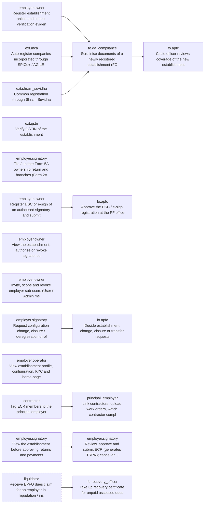

### F02 — Member onboarding, KYC and profile correction

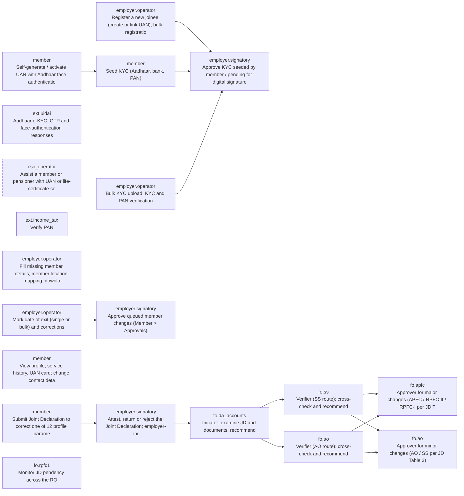

### F03 — ECR, challan, payment and contribution posting

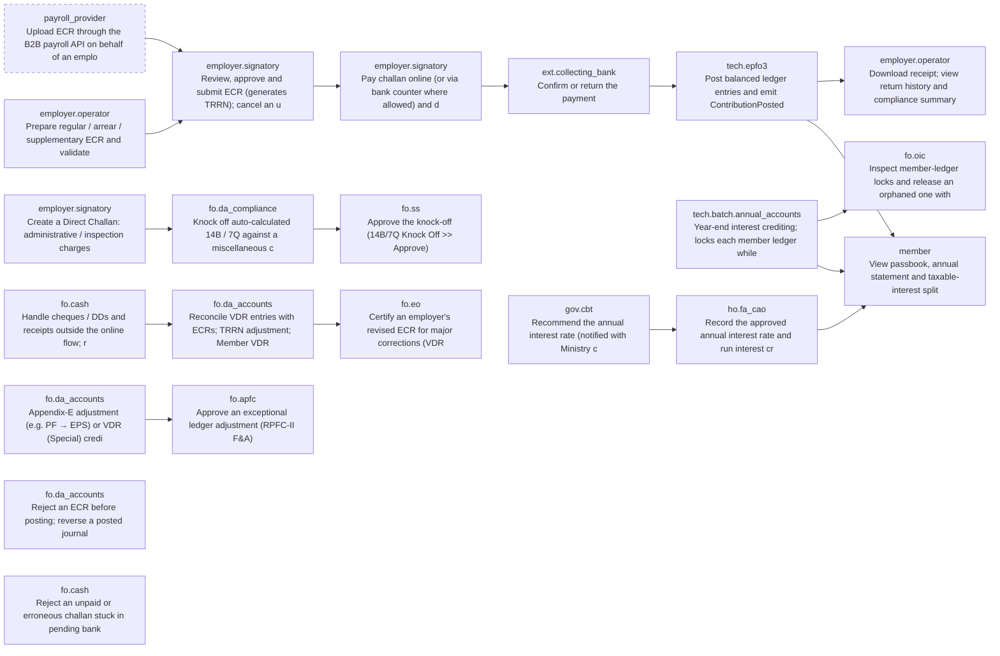

### F04 — PF claims, transfers and death / EDLI claims

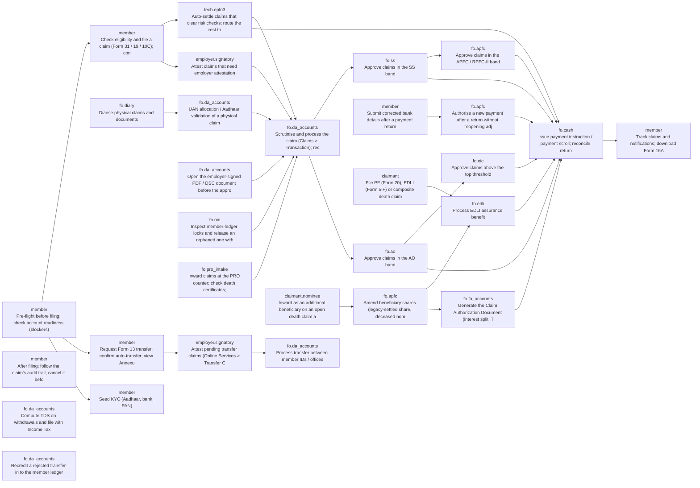

### F05 — Pension: application, PPO, disbursement, life certificate

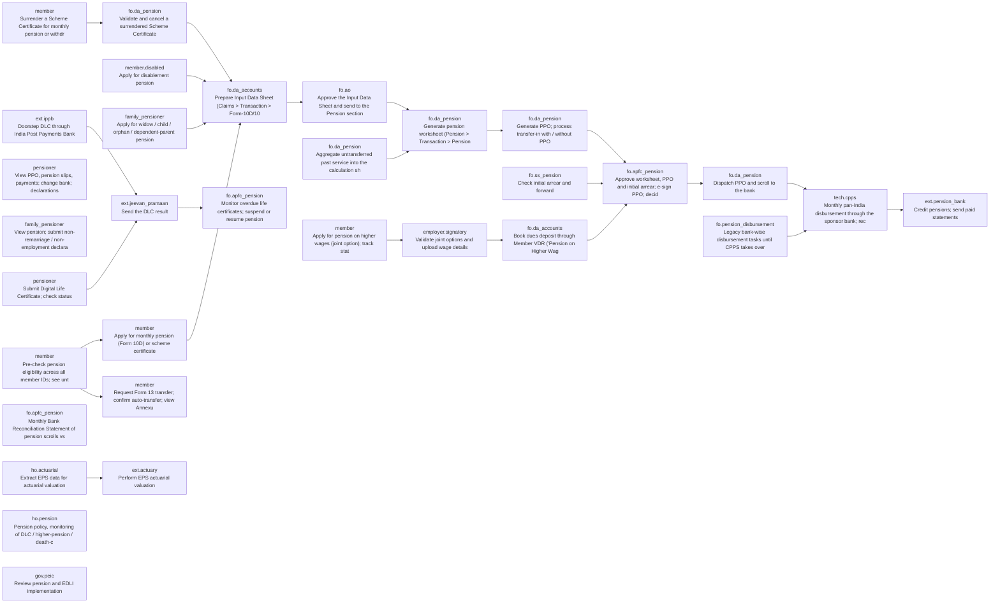

### F06 — Compliance, inspection, quasi-judicial proceedings and recovery

```mermaid
flowchart LR
  F06_detect["ho.caiu<br/>Analyse data and allocate risk-based inspections / risk sign"]
  F06_defaulters["fo.da_compliance<br/>Identify non-filers / short payers; open compliance case"]
  F06_schedule["fo.apfc<br/>Circle officer schedules inspection (incl. CAIU-allocated)"]
  F06_inspect["fo.icf<br/>Conduct inspection; upload report on Unified Portal and Shra"]
  style F06_inspect stroke-dasharray: 5 5
  F06_inspect_legacy["fo.eo<br/>Enforcement Officer inspection (legacy role before ICF)"]
  F06_report_process["fo.da_compliance<br/>Process inspection report in the e-Office file within 3 work"]
  F06_proceed["fo.apfc<br/>Quasi-judicial authority: issue notice / summons, hold heari"]
  F06_order["fo.apfc<br/>Pass 7A / 14B / 7Q order (e-Proceedings Final Order); 7B rev"]
  F06_employer_reply["employer.signatory<br/>Reply and submit evidence in proceedings"]
  F06_vishwas_apply["employer.signatory<br/>Apply under VISHWAS to settle a 14B damages / penalty disput"]
  F06_vishwas_decide["fo.apfc<br/>Recalculate damages under VISHWAS and decide; revised demand"]
  F06_appeal["ext.cgit<br/>Tribunal hears 7-I appeals and decides 7-O pre-deposit / wai"]
  F06_courts["ext.courts<br/>Writs and orders on EPFO matters"]
  F06_legal["fo.legal<br/>Record 7-I appeals, 7-O pre-deposits / waivers and court / t"]
  F06_recovery["fo.recovery_officer<br/>Take up recovery certificate for unpaid assessed dues"]
  F06_garnishee["fo.recovery_officer<br/>8F garnishee order on bank / debtor (demo record only)"]
  F06_attach["fo.recovery_officer<br/>Attach movable / immovable property (demo record only)"]
  F06_sale["fo.recovery_officer<br/>Sale of attached property (demo record only)"]
  F06_receiver["fo.recovery_officer<br/>Appoint receiver for business / property (demo record only)"]
  F06_arrest["fo.recovery_officer<br/>Arrest and detention of defaulter as last resort (demo recor"]
  F06_prosecution["fo.apfc<br/>Initiate prosecution"]
  F06_district["do.staff<br/>District-level compliance follow-up and facilitation"]
  style F06_district stroke-dasharray: 5 5
  F06_ho_policy["ho.compliance<br/>Compliance policy and e-Proceedings oversight"]
  F06_ho_recovery["ho.recovery<br/>Recovery policy and monitoring"]
  F06_ho_legal["ho.legal<br/>Legal policy; monitoring of court cases"]
  F06_detect --> F06_schedule
  F06_defaulters --> F06_schedule
  F06_schedule --> F06_inspect
  F06_inspect --> F06_report_process
  F06_inspect_legacy --> F06_report_process
  F06_report_process --> F06_proceed
  F06_proceed --> F06_employer_reply
  F03_direct_challan["employer.signatory<br/>Create a Direct Challan: administrative / inspection charges"]
  F06_order --> F03_direct_challan
  F06_order --> F06_appeal
  F06_order --> F06_recovery
  F06_employer_reply --> F06_order
  F06_vishwas_apply --> F06_vishwas_decide
  F06_vishwas_decide --> F03_direct_challan
  F06_appeal --> F06_legal
  F06_courts --> F06_legal
  F06_recovery --> F06_garnishee
  F06_recovery --> F06_attach
  F06_attach --> F06_sale
  F06_attach --> F06_receiver
  F06_receiver --> F06_arrest
  F06_prosecution --> F06_legal
  F06_district --> F06_schedule
```

### F07 — Freezing, de-freezing, fraud and vigilance

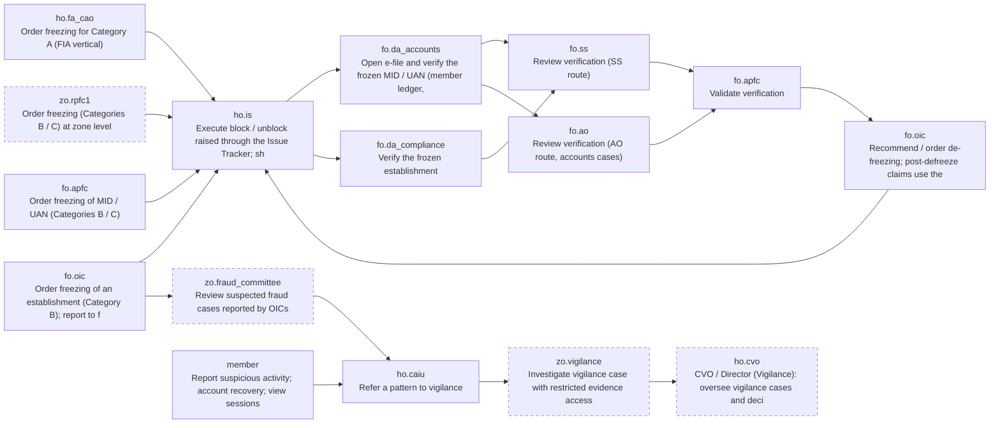

### F08 — Grievances

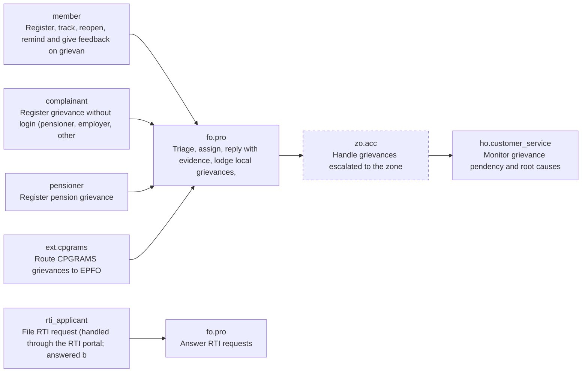

### F09 — Exempted establishments (PF trusts)

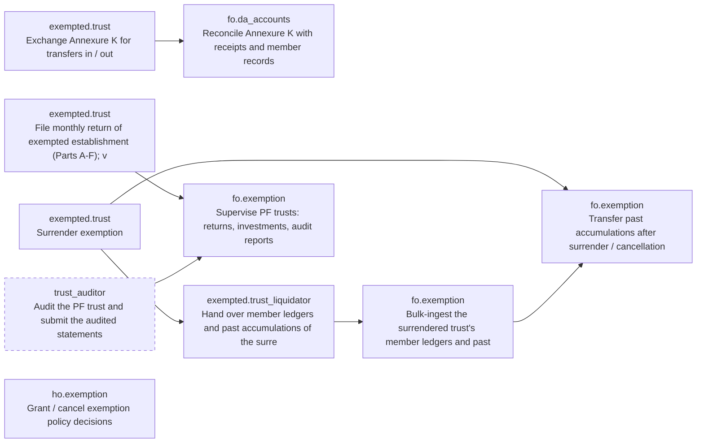

### F10 — International workers

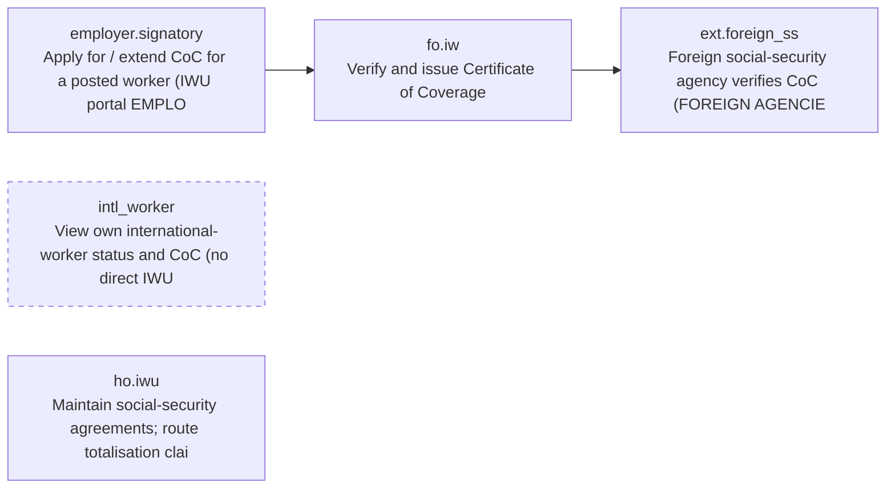

### F11 — Inoperative accounts

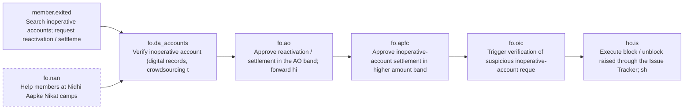

### F12 — Audit (concurrent, internal, external)

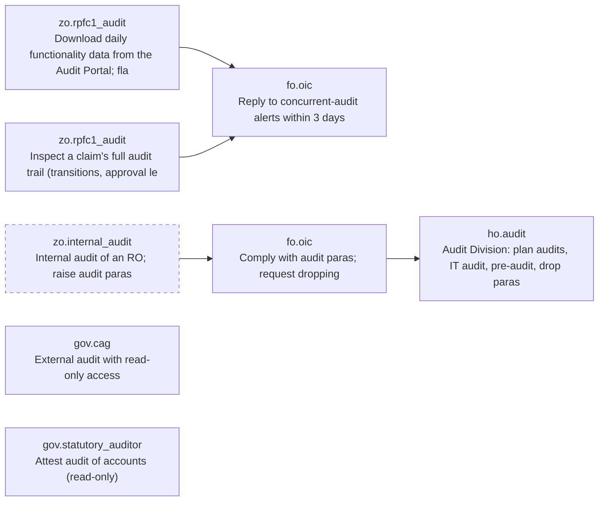

### F13 — Monitoring, governance and reporting

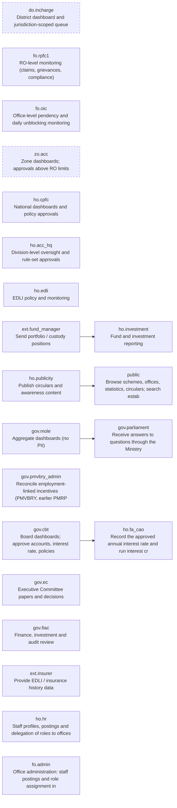

### F14 — Technology, security, data protection and training

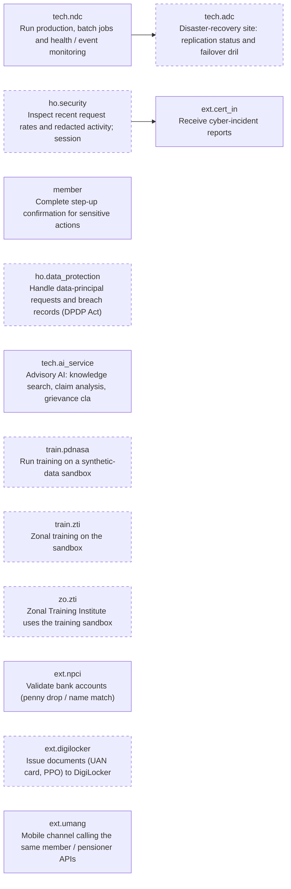

